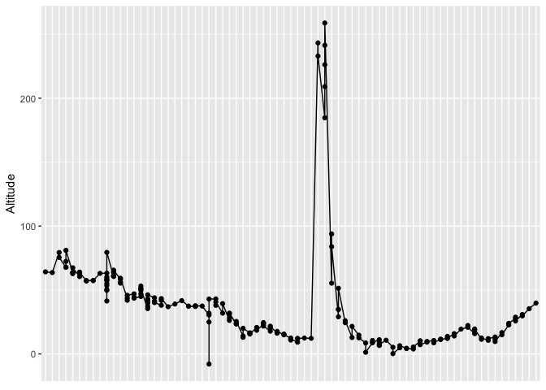

## Knit File


## Install and load packages


```r
library(tidyverse)
```

```
## ── Attaching packages ─────────────────────────────────────────────────────────────────────────────────── tidyverse 1.2.1 ──
```

```
## ✔ ggplot2 3.0.0     ✔ purrr   0.2.5
## ✔ tibble  1.4.2     ✔ dplyr   0.7.6
## ✔ tidyr   0.8.1     ✔ stringr 1.3.1
## ✔ readr   1.1.1     ✔ forcats 0.3.0
```

```
## ── Conflicts ────────────────────────────────────────────────────────────────────────────────────── tidyverse_conflicts() ──
## ✖ dplyr::filter() masks stats::filter()
## ✖ dplyr::lag()    masks stats::lag()
```

```r
library(dplyr)
```

## Reading in data


```r
gps_data <- read_csv("coordinates.csv")
```

```
## Parsed with column specification:
## cols(
##   uuid = col_character(),
##   id = col_integer(),
##   latitude = col_double(),
##   longitude = col_double(),
##   altitude = col_double(),
##   speed = col_double(),
##   direction = col_character(),
##   h_accuracy = col_double(),
##   v_accuracy = col_double(),
##   acceleration_x = col_integer(),
##   acceleration_y = col_integer(),
##   acceleration_z = col_integer(),
##   mode_detected = col_character(),
##   timestamp = col_character()
## )
```

```r
cchs <- read_csv("/Volumes/hkr-storage/Research/dfuller/Walkabilly/people/Melissa Tobin/HKR6130_MUN-master/cchs.csv")
```

```
## Parsed with column specification:
## cols(
##   CASEID = col_integer(),
##   verdate = col_integer(),
##   geogprv = col_integer(),
##   hwtghtm = col_double(),
##   hwtgwtk = col_double()
## )
```

# HKR 6130 - Week 8 Tutorial - GPS
## Read in GPS Data


```r
gps <- read_csv("/Volumes/hkr-storage/Research/dfuller/Walkabilly/people/Melissa Tobin/HKR6130_MUN-master/gps_user1.csv")
```

```
## Warning: Missing column names filled in: 'X1' [1]
```

```
## Parsed with column specification:
## cols(
##   X1 = col_integer(),
##   uuid = col_character(),
##   id = col_integer(),
##   latitude = col_double(),
##   longitude = col_double(),
##   altitude = col_double(),
##   speed = col_double(),
##   direction = col_character(),
##   h_accuracy = col_double(),
##   v_accuracy = col_double(),
##   acceleration_x = col_integer(),
##   acceleration_y = col_integer(),
##   acceleration_z = col_integer(),
##   mode_detected = col_character(),
##   timestamp = col_character(),
##   timestamp2 = col_date(format = "")
## )
```

```r
gps <- gps[order(gps$uuid),]
head(gps)
```

```
## # A tibble: 6 x 16
##      X1 uuid      id latitude longitude altitude speed direction h_accuracy
##   <int> <chr>  <int>    <dbl>     <dbl>    <dbl> <dbl> <chr>          <dbl>
## 1  4300 88C6… 5.04e6     47.6     -52.7     64.2 -1    <NA>              65
## 2  4301 88C6… 5.13e6     47.6     -52.7     63.6 -1    <NA>              65
## 3  4302 88C6… 5.13e6     47.6     -52.7     79.3  1.86 <NA>               5
## 4  4303 88C6… 5.13e6     47.6     -52.7     75.5  2.12 <NA>              10
## 5  4304 88C6… 5.13e6     47.6     -52.7     67.7  2.16 <NA>               5
## 6  4305 88C6… 5.13e6     47.6     -52.7     67.8  1.73 <NA>               5
## # ... with 7 more variables: v_accuracy <dbl>, acceleration_x <int>,
## #   acceleration_y <int>, acceleration_z <int>, mode_detected <chr>,
## #   timestamp <chr>, timestamp2 <date>
```

## Add new variable to GPS dataset


```r
gps$timestamp2 <- as.Date(as.factor(gps$timestamp))
```

## Unique participant in GPS data


```r
users <- unique(gps$uuid)
table(users)
```

```
## users
## 88C6D155-9D4A-4896-9FC9-ADB50B764991 
##                                    1
```

## Exploring participant data


```r
day_1 <- "2017-07-14"
user <- "DFuller"
user_ij <- filter(gps, gps$timestamp2 == day_1)
```

## Plotting the altitude record


```r
ggplot(data = user_ij, aes(x = timestamp, y = altitude)) +
  geom_point()+
  geom_line(aes(group = 1)) +
  theme(axis.ticks.x = element_blank(), 
        axis.text.x = element_blank(),
        axis.title.x = element_blank()) +
  labs(y = "Altitude")
```

<!-- -->

## PLot the speed at each GPS Location 


```r
ggplot(data = user_ij, aes(x = timestamp, y = speed)) +
  geom_point() +
  geom_line(aes(group = 1)) +
  theme(axis.ticks.x = element_blank(), 
        axis.text.x = element_blank(),
        axis.title.x = element_blank()) +
  labs(y = "speed")
```

<!-- -->

## Plot the GPS Points without a map background


```r
title = paste("Activity route of participant\n", as.character(user) , "\n", "on day", day_1, sep = " ")
ggplot()+
  geom_point(data = user_ij, aes(x = longitude, y = latitude), size = 1.5, color = "red") +
  labs(title = title, x = "Longitude", y = "Latitude")
```

<!-- -->

